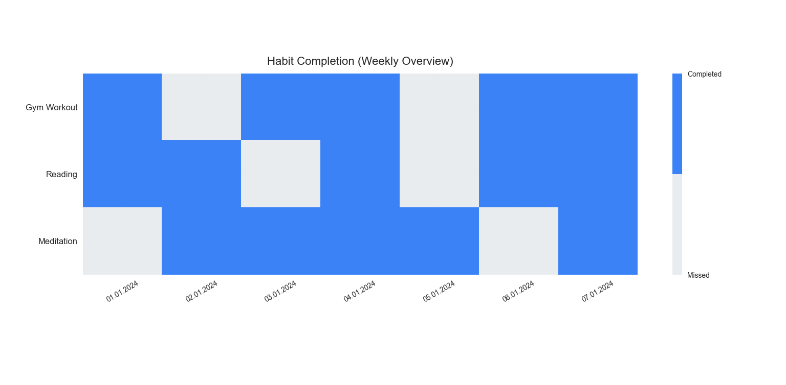

# 📊 Habit Tracker (Python)

## 🚀 Overview

A Python-based habit tracking tool that visualizes weekly progress using a heatmap and calculates key performance metrics such as completion rates and streaks.

## 📸 Example Output



## 📈 Weekly Statistics

| Habit       | Completion | Current Streak | Longest Streak |
| ----------- | ---------- | -------------- | -------------- |
| Gym Workout | 71%        | 2 days         | 2 days         |
| Reading     | 71%        | 2 days         | 2 days         |
| Meditation  | 71%        | 1 days         | 4 days         |

**Overall Completion Rate:** 71%

## 🛠️ Tech Stack

* Python 3.14
* NumPy
* Matplotlib

## ▶️ How to Run

```bash
pip install numpy matplotlib
python main.py
```
